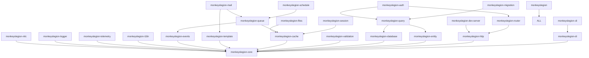

# MonkeysLegion v2 — Code Standards & Conventions

> **Version:** 2.0.0-draft  
> **PHP Requirement:** `^8.4`  
> **Last Updated:** March 2026  
> **Status:** Living Document — Approved for v2 development

---

## Table of Contents

1. [Philosophy & Goals](#1-philosophy--goals)
2. [PHP 8.4 Baseline & Language Standards](#2-php-84-baseline--language-standards)
3. [Code Formatting & Style Standards](#3-code-formatting--style-standards)
4. [Project Structure & Naming Conventions](#4-project-structure--naming-conventions)
5. [Attribute-First Architecture](#5-attribute-first-architecture)
6. [Package Standards (All 25 Packages)](#6-package-standards-all-25-packages)
7. [Entity & Data Layer Standards](#7-entity--data-layer-standards)
8. [HTTP, Routing & Controller Standards](#8-http-routing--controller-standards)
9. [Dependency Injection & Service Standards](#9-dependency-injection--service-standards)
10. [Queue, Events & Async Standards](#10-queue-events--async-standards)
11. [Testing & Quality Standards](#11-testing--quality-standards)
12. [Configuration & Environment Standards](#12-configuration--environment-standards)
13. [Laravel-Competitive Features Roadmap](#13-laravel-competitive-features-roadmap)

---

## 1. Philosophy & Goals

### 1.1 Core Principles

| Principle | Description |
|-----------|-------------|
| **Attribute-First** | PHP 8.4 attributes are the primary configuration mechanism — no magic strings, no array configs for domain logic |
| **Type-Safe Everything** | Every property typed, every return typed, every parameter typed — PHPStan level 9 |
| **PSR Compliance** | PSR-1, PSR-4, PSR-7, PSR-11, PSR-12, PSR-15 — non-negotiable |
| **Zero Magic** | No `__get`, no `__set`, no `__call` on public APIs — use property hooks instead |
| **Competitive with Laravel 13** | Feature parity or superiority on attributes, JSON:API, queue routing, AI SDK, vector search |
| **Modular by Default** | Every package installable independently — no god-package dependencies |

### 1.2 Competitive Positioning vs Laravel 13

```
┌─────────────────────────┬──────────────────────┬──────────────────────────┐
│ Feature                 │ Laravel 13           │ MonkeysLegion v2         │
├─────────────────────────┼──────────────────────┼──────────────────────────┤
│ PHP Minimum             │ 8.3                  │ 8.4 (property hooks!)    │
│ Attributes on Models    │ Optional (15+ spots) │ Mandatory & deeper       │
│ Property Hooks          │ ✗ Not used           │ ✓ First-class support    │
│ Asymmetric Visibility   │ ✗ Not used           │ ✓ Entities & DTOs        │
│ JSON:API Resources      │ First-party          │ First-party + OpenAPI    │
│ Queue Routing           │ Queue::route()       │ #[QueueRoute] attribute  │
│ AI/MCP Integration      │ Laravel Boost/AI SDK │ MonkeysAI package        │
│ Vector Search           │ Native pgvector      │ Native multi-driver      │
│ Config Format           │ PHP arrays           │ .mlc (typed, env-aware)  │
│ DI Container            │ Service Container    │ PSR-11 + compiled cache  │
│ Template Engine         │ Blade                │ MLView (components/slots)│
└─────────────────────────┴──────────────────────┴──────────────────────────┘
```

---

## 2. PHP 8.4 Baseline & Language Standards

### 2.1 Mandatory PHP 8.4 Features

Every file in the MonkeysLegion v2 codebase **MUST** use:

```php
<?php
declare(strict_types=1);
```

> [!IMPORTANT]
> `declare(strict_types=1)` is **required** in every single PHP file. No exceptions.

### 2.2 Property Hooks (NEW in v2)

Use property hooks to replace traditional getters/setters. This is a **core differentiator** vs Laravel 13.

```php
// ✅ v2 Standard — Property Hooks
#[Entity(table: 'users')]
class User
{
    #[Field(type: 'string', length: 255)]
    public string $email {
        set(string $value) {
            $this->email = strtolower(trim($value));
        }
    }

    #[Field(type: 'string', length: 255)]
    public string $name {
        get => ucfirst($this->name);
        set(string $value) {
            if (strlen($value) === 0) {
                throw new \InvalidArgumentException('Name cannot be empty');
            }
            $this->name = $value;
        }
    }

    // Computed/virtual property — no backing store needed
    public string $displayName {
        get => "{$this->name} <{$this->email}>";
    }
}
```

```php
// ❌ v1 Legacy — Do NOT use in v2
class User
{
    public function getEmail(): string { return $this->email; }
    public function setEmail(string $email): self {
        $this->email = strtolower(trim($email));
        return $this;
    }
}
```

> [!WARNING]
> Traditional `getX()`/`setX()` methods are **deprecated** in v2 for entity properties. Use property hooks. Exception: interface-required methods like `getAuthIdentifier()`.

### 2.3 Asymmetric Visibility

Use asymmetric visibility for entities, DTOs, and value objects:

```php
// ✅ Correct — publicly readable, privately writable
class Order
{
    public private(set) int $id;
    public private(set) string $status;
    public protected(set) float $total;

    // Read-only computed
    public string $formattedTotal {
        get => number_format($this->total, 2) . ' USD';
    }
}
```

```php
// ✅ DTOs — use readonly + asymmetric when needed
final readonly class CreateUserRequest
{
    public function __construct(
        #[NotBlank] #[Email]
        public string $email,

        #[NotBlank] #[Length(min: 8, max: 64)]
        public string $password,
    ) {}
}
```

### 2.4 Type Standards

| Context | Rule |
|---------|------|
| Properties | Always typed. Use `?Type` for nullable, never `mixed` unless truly polymorphic |
| Parameters | Always typed. Use union types `string\|int` sparingly |
| Return types | Always declared. Use `never` for methods that always throw. Use `void` explicitly |
| Arrays | Always document shape via `@param array<string, int>` or `@return list<User>` |
| Enums | Prefer backed enums (`enum Status: string`) over string constants |
| Intersection types | Use `Type&OtherType` for combined interfaces |

### 2.5 Enum Standards

```php
// ✅ Always use backed enums
enum OrderStatus: string
{
    case Pending   = 'pending';
    case Confirmed = 'confirmed';
    case Shipped   = 'shipped';
    case Delivered = 'delivered';
    case Cancelled = 'cancelled';

    public function label(): string
    {
        return match ($this) {
            self::Pending   => 'Pending Review',
            self::Confirmed => 'Confirmed',
            self::Shipped   => 'In Transit',
            self::Delivered => 'Delivered',
            self::Cancelled => 'Cancelled',
        };
    }

    public function isFinal(): bool
    {
        return in_array($this, [self::Delivered, self::Cancelled], true);
    }
}
```

### 2.6 Banned Patterns

| Pattern | Replacement |
|---------|-------------|
| `__get` / `__set` magic | Property hooks |
| `__call` / `__callStatic` | Explicit methods or `#[Proxy]` attribute |
| `extract()` / `compact()` | Named parameters / explicit arrays |
| `eval()` | Never. Period. |
| `@` error suppression | Proper error handling |
| `global $var` | Dependency injection |
| `mixed` without justification | Specific types or generics |
| Annotations in docblocks for config | PHP 8.4 native attributes |
| `$this->` fluent returns on setters | Property hooks |

---

## 3. Code Formatting & Style Standards

### 3.1 Indentation & Spacing

| Rule | Standard |
|------|----------|
| **Indentation** | 4 spaces. **Never tabs.** |
| **Line length** | Soft limit: **120 characters**. Hard limit: **150 characters**. |
| **Line endings** | LF (`\n`) only. Never CRLF. |
| **Trailing whitespace** | Forbidden. Configure your editor to strip automatically. |
| **Final newline** | Every file MUST end with a single blank line (`\n`). |
| **Encoding** | UTF-8 without BOM. |

```php
// ✅ Correct — 4 spaces, within 120 chars
public function findActiveOrders(int $userId, OrderStatus $status): array
{
    return $this->query()
        ->where('user_id', '=', $userId)
        ->where('status', '=', $status->value)
        ->orderBy('created_at', 'DESC')
        ->fetchAll();
}

// ❌ Wrong — tabs, exceeds line length
public function findActiveOrders(int $userId, OrderStatus $status): array { return $this->query()->where('user_id', '=', $userId)->where('status', '=', $status->value)->orderBy('created_at', 'DESC')->fetchAll(); }
```

### 3.2 Braces & Control Structures

| Element | Brace Placement |
|---------|----------------|
| **Classes** | Opening brace on **next line** |
| **Methods** | Opening brace on **next line** |
| **Control structures** (`if`, `for`, `while`, `switch`, `try`) | Opening brace on **same line** |
| **Closures / Arrow functions** | Opening brace on **same line** |
| **Property hooks** | Opening brace on **same line** as the hook |

```php
// ✅ Correct brace placement
class OrderService
{
    public function processOrder(Order $order): void
    {
        if ($order->isCancellable) {
            // same-line brace for control structures
            foreach ($order->items as $item) {
                $this->validateStock($item);
            }
        } else {
            throw new DomainException('Order cannot be processed');
        }

        try {
            $this->chargePayment($order);
        } catch (PaymentException $e) {
            $this->logger->error('Payment failed', ['order' => $order->id]);
            throw $e;
        }
    }
}
```

**Control structure rules:**

```php
// ✅ Always use braces, even for single-line bodies
if ($user->isAdmin()) {
    return true;
}

// ❌ Never omit braces
if ($user->isAdmin()) return true;
if ($user->isAdmin())
    return true;

// ✅ Ternary for simple expressions (single line only)
$label = $order->isPaid ? 'Paid' : 'Pending';

// ✅ Null coalescing
$name = $user->name ?? 'Anonymous';

// ✅ Match expression (preferred over switch for value-returning)
$icon = match ($status) {
    OrderStatus::Pending   => '⏳',
    OrderStatus::Confirmed => '✅',
    OrderStatus::Shipped   => '📦',
    OrderStatus::Delivered => '🎉',
    OrderStatus::Cancelled => '❌',
};

// ✅ Multi-line ternary — operator on new line, indented
$message = $order->total > 1000
    ? 'Thank you for your large order!'
    : 'Thank you for your order!';
```

### 3.3 Blank Lines & Vertical Spacing

| Context | Blank Lines |
|---------|-------------|
| After `<?php declare(strict_types=1);` | **1 blank line** |
| After `namespace` declaration | **1 blank line** |
| Between `use` import groups | **1 blank line** |
| After last `use` import | **1 blank line** |
| Before class declaration | **0 blank lines** (directly after imports) |
| After class opening brace `{` | **0 blank lines** |
| Between class constants and properties | **1 blank line** |
| Between properties and methods | **1 blank line** |
| Between methods | **1 blank line** |
| Between section divider comments | **1 blank line** before divider |
| Before class closing brace `}` | **0 blank lines** |
| Inside method bodies — logical groups | **1 blank line** to separate logical steps |
| Consecutive blank lines | **Never** — max 1 blank line anywhere |

```php
<?php
declare(strict_types=1);

namespace App\Service;

use MonkeysLegion\DI\Attributes\Singleton;
use MonkeysLegion\Events\EventDispatcher;

use Psr\Log\LoggerInterface;

use App\Entity\User;
use App\Repository\UserRepository;

#[Singleton]
final class UserService
{
    private const int MAX_LOGIN_ATTEMPTS = 5;
    private const string DEFAULT_ROLE = 'user';

    public function __construct(
        private readonly UserRepository $users,
        private readonly EventDispatcher $events,
        private readonly LoggerInterface $logger,
    ) {}

    public function findUser(int $id): ?User
    {
        return $this->users->find($id);
    }

    public function createUser(string $email, string $password): User
    {
        // Validate input
        $this->validateEmail($email);

        // Create entity
        $user = new User();
        $user->email = $email;
        $user->password_hash = password_hash($password, PASSWORD_DEFAULT);

        // Persist and notify
        $this->users->persist($user);
        $this->events->dispatch(new UserCreated($user));

        return $user;
    }
}
```

### 3.4 Operator Spacing

| Operator | Spacing | Example |
|----------|---------|--------|
| Assignment (`=`, `+=`, `.=`, etc.) | 1 space each side | `$x = 1;` |
| Comparison (`===`, `!==`, `>`, `<`, `>=`, `<=`) | 1 space each side | `$a === $b` |
| Arithmetic (`+`, `-`, `*`, `/`, `%`, `**`) | 1 space each side | `$a + $b` |
| String concatenation (`.`) | 1 space each side | `$a . $b` |
| Arrow operator (`->`) | **No spaces** | `$this->name` |
| Null-safe (`?->`) | **No spaces** | `$user?->profile` |
| Double colon (`::`) | **No spaces** | `User::class` |
| Spread (`...`) | **No space** after | `...$args` |
| Reference (`&`) | **No space** after | `&$value` |
| Type union (`\|`) | **No spaces** | `string\|int` |
| Type intersection (`&`) | **No spaces** | `Countable&Iterator` |
| Ternary (`?`, `:`) | 1 space each side | `$a ? $b : $c` |
| Null coalescing (`??`) | 1 space each side | `$a ?? $b` |
| Array arrow (`=>`) | 1 space each side | `'key' => 'value'` |
| Negation (`!`) | **No space** after | `!$valid` |
| Cast | 1 space after cast | `(int) $value` |

```php
// ✅ Correct operator spacing
$total = $subtotal + ($subtotal * $taxRate);
$name = $firstName . ' ' . $lastName;
$status = $order?->status ?? OrderStatus::Pending;
$ids = array_map(fn(User $u) => $u->id, $users);
$isAdmin = !$user->isGuest() && $user->hasRole('admin');
$count = (int) $request->getQueryParams()['count'];
```

### 3.5 Array Formatting

```php
// ✅ Short syntax only — never array()
$empty = [];
$single = ['one'];
$inline = ['key' => 'value', 'foo' => 'bar'];  // If fits in 120 chars

// ✅ Multi-line with trailing comma
$config = [
    'driver'   => 'mysql',
    'host'     => 'localhost',
    'port'     => 3306,
    'database' => 'myapp',
    'charset'  => 'utf8mb4',
];

// ✅ Nested arrays — each level gets 4-space indent
$routes = [
    'api' => [
        'prefix'     => '/api/v2',
        'middleware' => ['cors', 'auth', 'throttle'],
        'routes'     => [
            'users'  => UserController::class,
            'orders' => OrderController::class,
        ],
    ],
];

// ❌ Never use long array syntax
$bad = array('key' => 'value');

// ✅ Align => arrows when it improves readability (optional, not enforced)
$map = [
    'pending'   => 'Pending Review',
    'confirmed' => 'Order Confirmed',
    'shipped'   => 'In Transit',
];
```

### 3.6 Method & Function Signatures

```php
// ✅ Short signature — everything on one line
public function find(int $id): ?User

// ✅ Long signature — one parameter per line, closing paren + return on own line
public function createOrder(
    int $userId,
    array $items,
    string $shippingMethod = 'standard',
    ?string $couponCode = null,
): Order {
    // body
}

// ✅ Constructor promotion — one parameter per line
public function __construct(
    private readonly UserRepository $users,
    private readonly EventDispatcher $events,
    private readonly LoggerInterface $logger,
) {}

// ✅ Closure / arrow function
$filtered = array_filter(
    $users,
    fn(User $u) => $u->isActive() && $u->hasVerifiedEmail(),
);

// ✅ Chained method calls — one per line, indented
$result = $this->query()
    ->select(['id', 'email', 'name'])
    ->from('users')
    ->where('status', '=', 'active')
    ->orderBy('name', 'ASC')
    ->limit(25)
    ->fetchAll();
```

**When to break parameters across lines:**
- If the full signature exceeds **120 characters**, break to multi-line
- If there are **4 or more parameters**, always break to multi-line
- Trailing comma is **required** on multi-line parameter lists

### 3.7 Comment Standards

#### 3.7.1 PHPDoc Blocks

**When to use PHPDoc:**

| Scenario | PHPDoc Required? |
|----------|------------------|
| Public methods on framework packages | ✅ Always |
| Public methods on app code | ✅ When non-obvious |
| Private/protected methods | ⚠️ Only if complex logic |
| Properties with native types | ❌ No — type speaks for itself |
| Properties with array shapes | ✅ Yes — document `@var array<string, int>` |
| Interface methods | ✅ Always |
| Constructors with promoted params | ❌ No — unless complex |
| Trivially simple getters | ❌ No |

```php
// ✅ Correct PHPDoc format
/**
 * Find users matching the given search criteria.
 *
 * Results are paginated and sorted by relevance score.
 * Only active, non-suspended users are included.
 *
 * @param array<string, mixed> $criteria Search filters
 * @param int                  $page     Page number (1-indexed)
 * @param int                  $perPage  Results per page (max: 100)
 *
 * @return array{data: list<User>, total: int, page: int, lastPage: int}
 *
 * @throws InvalidArgumentException If $perPage exceeds 100
 * @throws DatabaseException       On connection failure
 */
public function search(array $criteria, int $page = 1, int $perPage = 25): array

// ❌ Useless PHPDoc — just repeats the type signature
/**
 * Get the user ID.
 *
 * @return int The user ID.
 */
public function getId(): int   // ← The types already say everything
```

**PHPDoc formatting rules:**

| Rule | Standard |
|------|----------|
| Opening `/**` | Own line |
| Each `@param` | Aligned type + variable + description |
| `@return` | After params, separated by blank line |
| `@throws` | After return, each on own line |
| Closing `*/` | Own line |
| Summary line | Max 1 sentence, ends with period |
| Description body | Separated from summary by blank line |
| Line length | Same 120-char limit as code |
| Alignment | Align `@param` types and variable names vertically |

#### 3.7.2 Inline Comments

```php
// ✅ Use // for inline comments — 1 space after //
// Calculate the total with tax applied
$total = $subtotal * (1 + $taxRate);

// ✅ Comment explains WHY, not WHAT
// Offset by 1 because the API is 0-indexed but our pagination is 1-indexed
$apiPage = $page - 1;

// ❌ Useless comment — code is self-documenting
// Set the name
$user->name = $name;

// ❌ Never use # for comments in PHP
# This is wrong

// ❌ Never use block comments /* */ for inline comments
/* This is wrong too */
```

**Inline comment rules:**

| Rule | Standard |
|------|----------|
| Style | Always `//` — never `#` or `/* */` inline |
| Spacing | 1 space after `//` |
| Placement | On the line **above** the code it explains |
| End-of-line comments | Avoid. Only for very short clarifications: `$x = 1; // fallback` |
| Language | English only |
| Capitalization | Start with uppercase letter |
| Period | Optional for short comments, required for full sentences |
| TODO/FIXME | Format: `// TODO(username): description` or `// FIXME(username): description` |

#### 3.7.3 Section Divider Comments

Use ASCII dividers to organize large classes into logical sections:

```php
class User
{
    // ── Fields ──────────────────────────────────────────────────

    #[Id]
    #[Field(type: 'integer')]
    public private(set) int $id;

    #[Field(type: 'string', length: 255)]
    public string $email;

    // ── Relationships ──────────────────────────────────────────

    #[ManyToMany(targetEntity: Role::class, inversedBy: 'users')]
    public array $roles = [];

    // ── Computed Properties ────────────────────────────────────

    public string $displayName {
        get => $this->name . ' <' . $this->email . '>';
    }

    // ── Business Logic ─────────────────────────────────────────

    public function markEmailVerified(): void
    {
        $this->email_verified_at = new \DateTimeImmutable();
    }

    // ── Interface: AuthenticatableInterface ─────────────────────

    public function getAuthIdentifier(): int|string
    {
        return $this->id;
    }
}
```

**Section divider format:**
- Prefix: `// ── `
- Title: Descriptive section name
- Suffix: ` ` + repeated `─` to reach ~66 chars total
- 1 blank line before the divider, 1 blank line after

#### 3.7.4 File Header Comments

```php
// ✅ Framework packages — include license header
/**
 * MonkeysLegion Framework — Router Package
 *
 * @copyright 2026 MonkeysCloud Team
 * @license   MIT
 */

// ❌ App code does NOT need a file header comment
// The namespace + class PHPDoc is sufficient
```

### 3.8 Class Member Ordering

Elements within a class MUST follow this order:

```
1. Constants (public → protected → private)
2. Static properties (public → protected → private)
3. Properties (public → protected → private)
   a. Entity fields (#[Field] annotated)
   b. Relationship properties (#[ManyToOne], #[OneToMany], etc.)
   c. Computed properties (property hooks, get-only)
4. Constructor
5. Static factory methods
6. Public methods
7. Protected methods
8. Private methods
```

```php
class Order
{
    // 1. Constants
    public const string STATUS_PENDING = 'pending';
    private const int MAX_ITEMS = 100;

    // 2. Properties — entity fields
    #[Id]
    public private(set) int $id;

    #[Field(type: 'string')]
    public string $status;

    // 2b. Properties — relationships
    #[OneToMany(targetEntity: OrderItem::class, mappedBy: 'order')]
    public array $items = [];

    // 2c. Properties — computed
    public int $itemCount {
        get => count($this->items);
    }

    // 3. Constructor
    public function __construct(
        private readonly EventDispatcher $events,
    ) {}

    // 4. Static factory methods
    public static function createDraft(User $user): self
    {
        $order = new self();
        $order->user = $user;
        $order->status = 'draft';
        return $order;
    }

    // 5. Public methods
    public function addItem(Product $product, int $qty): void { /* ... */ }
    public function submit(): void { /* ... */ }

    // 6. Protected methods
    protected function calculateTotal(): string { /* ... */ }

    // 7. Private methods
    private function validateItemCount(): void { /* ... */ }
}
```

### 3.9 String Standards

```php
// ✅ Single quotes for plain strings
$name = 'MonkeysLegion';
$key = 'database.host';

// ✅ Double quotes ONLY when interpolation is needed
$greeting = "Hello, {$user->name}!";
$dsn = "mysql:host={$host};port={$port};dbname={$db}";

// ✅ Curly-brace interpolation for property/method access
$message = "Order #{$order->id} placed by {$user->email}";

// ❌ Never concatenation when interpolation works
$bad = 'Hello, ' . $user->name . '!';

// ✅ Heredoc for multi-line strings (indented syntax)
$sql = <<<SQL
    SELECT u.id, u.email, COUNT(o.id) AS order_count
    FROM users u
    LEFT JOIN orders o ON o.user_id = u.id
    WHERE u.status = :status
    GROUP BY u.id
    SQL;

// ✅ sprintf for complex formatting
$log = sprintf(
    '[%s] User %d performed action "%s" on resource %s',
    $timestamp->format('c'),
    $userId,
    $action,
    $resourceId,
);

// ❌ Never use nowdoc unless zero interpolation is explicitly desired
```

### 3.10 Attribute Formatting

```php
// ✅ Single attribute — one line
#[Entity(table: 'users')]
class User

// ✅ Multiple attributes — each on its own line, grouped by concern
#[Entity(table: 'orders')]
#[SoftDeletes]
#[Timestamps]
#[ObservedBy(OrderObserver::class)]
class Order

// ✅ Attribute with many parameters — break if > 120 chars
#[Route(
    methods: 'GET',
    path: '/users/{id}',
    name: 'users.show',
    summary: 'Retrieve a single user by ID',
    tags: ['Users', 'API'],
    middleware: ['auth', 'throttle:30,1'],
)]
public function show(string $id): Response

// ✅ Stacked attributes on properties — one per line
#[Field(type: 'string', length: 255)]
#[Fillable]
#[Cast(OrderStatus::class)]
public OrderStatus $status;

// ✅ Inline attributes on constructor params — if short
public function __construct(
    #[NotBlank] #[Email] public string $email,
    #[NotBlank] #[Length(min: 8)] public string $password,
) {}

// ✅ Multi-line if attribute is long
public function __construct(
    #[Assert\NotBlank]
    #[Assert\Exists(table: 'users', column: 'id')]
    public int $userId,
) {}
```

### 3.11 `use` Import Standards

```php
<?php
declare(strict_types=1);

namespace App\Controller;

// ═══ Group 1: Framework imports (alphabetical) ═══
use MonkeysLegion\Auth\Attribute\Authenticated;
use MonkeysLegion\Auth\Attribute\RequiresRole;
use MonkeysLegion\Http\Message\Response;
use MonkeysLegion\Router\Attributes\Route;
use MonkeysLegion\Router\Attributes\RoutePrefix;

// ═══ Group 2: PSR / external library imports ═══
use Psr\Http\Message\ServerRequestInterface;
use Psr\Log\LoggerInterface;

// ═══ Group 3: PHP built-in classes ═══
use DateTimeImmutable;
use InvalidArgumentException;
use RuntimeException;

// ═══ Group 4: Application imports ═══
use App\Dto\CreateUserRequest;
use App\Entity\User;
use App\Repository\UserRepository;
use App\Service\UserService;
```

**Import rules:**

| Rule | Standard |
|------|----------|
| Order within groups | Alphabetical by full namespace |
| Grouped `use` | Allowed for same namespace: `use App\Dto\{CreateUserRequest, UpdateUserRequest};` |
| Max grouped imports | 5 — beyond that, use separate `use` statements |
| Unused imports | Forbidden. Tools must auto-remove. |
| `use function` / `use const` | Place after class imports, separated by blank line |
| Aliasing (`as`) | Only when name collision exists |
| Global functions | Always import: `use function array_map;` or use fully-qualified `\array_map()` |

### 3.12 MLC Config File Formatting

```mlc
# ═══════════════════════════════════════════════════════════════
# Section Title — Descriptive Name
# ═══════════════════════════════════════════════════════════════
#
# Optional explanation of what this section configures.
# Keep comments concise and useful.

section_name {
    # Simple key-value (4-space indent inside blocks)
    key_name    = "value"           # Align = signs within a block
    another_key = 3600              # Inline comment for clarification
    is_enabled  = true

    # Nested blocks get additional 4-space indent
    nested_block {
        inner_key   = "value"
        inner_key_2 = ${ENV_VAR:default_value}
    }

    # Arrays use JSON-style brackets
    list_values = [
        "item_one",
        "item_two",
        "item_three"
    ]
}
```

**MLC formatting rules:**

| Rule | Standard |
|------|----------|
| Indentation | 4 spaces inside blocks |
| Comments | `#` followed by 1 space |
| Section headers | `═` dividers with title |
| Key alignment | Align `=` signs within the same block level |
| String values | Double quotes for strings with special chars, unquoted for simple |
| Env variables | Format: `${VAR_NAME:default_value}` |
| Blank lines | 1 between logical groups inside a block |

### 3.13 MLView Template Formatting

```html
{{-- File: resources/views/orders/show.mlv --}}

@extends('layouts.app')

@section('title', "Order #{$order->id}")

@section('content')
    {{-- 4-space indent inside sections --}}
    <div class="order-detail">
        <h1>Order #{{ $order->id }}</h1>

        {{-- Components use self-closing when no slot content --}}
        <x-badge :status="$order->status" />

        {{-- Components with slots --}}
        <x-card title="Order Items">
            @foreach($order->items as $item)
                <x-order-item :item="$item" />
            @endforeach
        </x-card>

        {{-- Conditional rendering --}}
        @if($order->isCancellable)
            <form method="POST" action="/orders/{{ $order->id }}/cancel">
                @csrf
                <button type="submit">Cancel Order</button>
            </form>
        @endif
    </div>
@endsection
```

**Template formatting rules:**

| Rule | Standard |
|------|----------|
| Indentation | 4 spaces (matching PHP) |
| Template comments | `{{-- comment --}}` — never HTML `<!-- -->` for dev notes |
| Variable output | `{{ $var }}` — spaces inside braces |
| Raw output | `{!! $html !!}` — only when explicitly safe |
| Directives | `@directive` on own line, content indented |
| Self-closing components | `<x-name />` with space before `/>` |
| HTML attributes | Alphabetical when > 3 attributes |

### 3.14 EditorConfig

Every MonkeysLegion project MUST include this `.editorconfig`:

```ini
# .editorconfig
root = true

[*]
charset = utf-8
end_of_line = lf
insert_final_newline = true
trim_trailing_whitespace = true
indent_style = space
indent_size = 4

[*.md]
trim_trailing_whitespace = false

[*.{yml,yaml}]
indent_size = 2

[*.{json,js,ts}]
indent_size = 2

[Makefile]
indent_style = tab
```

### 3.15 Formatting Quick-Reference Card

```
╔══════════════════════════════════════════════════════════════╗
║  MonkeysLegion v2 — Formatting At a Glance                  ║
╠══════════════════════════════════════════════════════════════╣
║  Indentation:    4 spaces (never tabs)                      ║
║  Line length:    120 soft / 150 hard                        ║
║  Line endings:   LF only                                    ║
║  Final newline:  Required                                   ║
║  Encoding:       UTF-8 (no BOM)                             ║
║  Strings:        Single quotes (no interp), double (interp) ║
║  Arrays:         Short syntax [], trailing comma             ║
║  Braces:         Next line (class/method), same line (if)   ║
║  Comments:       // only, 1 space after, English             ║
║  PHPDoc:         When non-obvious, @param aligned            ║
║  Imports:        4 groups, alphabetical, blank line between  ║
║  Parameters:     Multi-line if > 120 chars or ≥ 4 params    ║
║  Trailing comma: Required on multi-line arrays/params        ║
║  Attributes:     Own line, named params, grouped by concern  ║
║  Operators:      1 space each side (except ->, ::, !)        ║
║  Chained calls:  1 per line, indented                        ║
╚══════════════════════════════════════════════════════════════╝
```

---

## 4. Project Structure & Naming Conventions

### 4.1 Skeleton Directory Layout (v2)

```
my-app/
├── app/
│   ├── Controller/          # HTTP controllers (auto-scanned)
│   ├── Command/             # CLI commands (auto-scanned)        [NEW v2]
│   ├── Dto/                 # Request/Response DTOs
│   ├── Entity/              # Database entities
│   ├── Enum/                # Backed enums                       [NEW v2]
│   ├── Event/               # Domain events                      [NEW v2]
│   ├── Job/                 # Queue jobs                         [NEW v2]
│   ├── Listener/            # Event listeners                    [NEW v2]
│   ├── Mail/                # Mailable classes                   [NEW v2]
│   ├── Middleware/           # Custom middleware                  [NEW v2]
│   ├── Observer/            # Entity observers
│   ├── Policy/              # Authorization policies             [NEW v2]
│   ├── Providers/           # Service providers
│   ├── Repository/          # Data repositories
│   ├── Resource/            # API resources (JSON:API)           [NEW v2]
│   └── Service/             # Business logic services            [NEW v2]
├── config/
│   ├── app.php              # DI overrides
│   ├── database.php         # Connection config
│   ├── *.mlc                # MLC config files
│   └── routes.php           # Manual route registration          [NEW v2]
├── database/
│   ├── seeders/             # Database seeders
│   └── factories/           # Entity factories (testing)         [NEW v2]
├── public/                  # Web root
├── resources/
│   ├── views/               # MLView templates
│   ├── lang/                # Translation files
│   └── assets/              # Frontend assets                    [NEW v2]
├── storage/
│   ├── app/                 # Application files
│   ├── logs/                # Log files
│   └── framework/           # Framework cache/sessions
├── tests/
│   ├── Unit/
│   ├── Integration/
│   └── Feature/             # Full HTTP feature tests            [NEW v2]
├── var/
│   ├── cache/               # Compiled templates, route cache
│   └── migrations/          # Auto-generated SQL
├── bootstrap.php
├── composer.json
├── phpstan.neon
└── phpunit.xml
```

### 4.2 Naming Conventions

| Element | Convention | Example |
|---------|-----------|---------|
| **Classes** | PascalCase, singular noun | `UserController`, `OrderService` |
| **Interfaces** | PascalCase + `Interface` suffix | `CacheInterface`, `AuthenticatableInterface` |
| **Traits** | PascalCase + `Trait` suffix | `HasRolesTrait`, `AuthenticatableTrait` |
| **Enums** | PascalCase, singular | `OrderStatus`, `UserRole` |
| **Attributes** | PascalCase, descriptive | `#[Entity]`, `#[Route]`, `#[Cached]` |
| **Methods** | camelCase, verb-first | `findById()`, `createUser()`, `isActive()` |
| **Properties** | camelCase (PHP) / snake_case (DB columns) | `$firstName` (PHP), `first_name` (DB) |
| **Constants** | UPPER_SNAKE_CASE | `MAX_RETRY_COUNT` |
| **Files** | Match class name exactly | `UserController.php`, `OrderStatus.php` |
| **Config keys** | snake_case with dots | `database.host`, `auth.jwt_secret` |
| **Routes** | kebab-case paths, dot-notation names | `/api/user-profiles`, `users.show` |
| **Tables** | snake_case, plural | `users`, `order_items`, `user_roles` |
| **Namespaces** | PascalCase, mirror directory | `App\Controller`, `MonkeysLegion\Router` |

### 4.3 File Header Standard

Every PHP file must follow this exact structure:

```php
<?php
declare(strict_types=1);

namespace App\Controller;

// Framework imports (alphabetical)
use MonkeysLegion\Router\Attributes\Route;
use MonkeysLegion\Router\Attributes\RoutePrefix;

// PSR imports (alphabetical)
use Psr\Http\Message\ResponseInterface;

// PHP built-in imports (alphabetical)
use DateTimeImmutable;
use InvalidArgumentException;

// App imports (alphabetical)
use App\Dto\CreateUserRequest;
use App\Entity\User;
```

> [!TIP]
> Import groups must be separated by blank lines. Use `use` statements — never use fully-qualified class names inline.

---

## 5. Attribute-First Architecture

### 5.1 Attribute Catalog (All Framework Attributes)

MonkeysLegion v2 provides a rich set of native attributes. **All** must be preferred over configuration arrays.

#### Entity Package (`monkeyslegion-entity`)

| Attribute | Target | Purpose |
|-----------|--------|---------|
| `#[Entity(table: 'x')]` | Class | Mark as database entity |
| `#[Field(type: 'x')]` | Property | Map property to DB column |
| `#[Id]` | Property | Primary key marker |
| `#[Uuid]` | Property | Auto-generated UUID |
| `#[Column(name: 'x')]` | Property | Custom column name mapping |
| `#[OneToMany(...)]` | Property | One-to-many relationship |
| `#[ManyToOne(...)]` | Property | Many-to-one relationship |
| `#[ManyToMany(...)]` | Property | Many-to-many relationship |
| `#[OneToOne(...)]` | Property | One-to-one relationship |
| `#[JoinTable(...)]` | Property | Junction table config |
| `#[ObservedBy(...)]` | Class | Register entity observer(s) |
| `#[Hidden]` | Property | **NEW v2** — Exclude from serialization |
| `#[Fillable]` | Property | **NEW v2** — Allow mass assignment |
| `#[Guarded]` | Property | **NEW v2** — Block mass assignment |
| `#[Cast(Type::class)]` | Property | **NEW v2** — Auto-cast values |
| `#[SoftDeletes]` | Class | **NEW v2** — Soft delete support |
| `#[Timestamps]` | Class | **NEW v2** — Auto created_at/updated_at |
| `#[Index(...)]` | Class/Property | **NEW v2** — Database index definition |

#### Router Package (`monkeyslegion-router`)

| Attribute | Target | Purpose |
|-----------|--------|---------|
| `#[Route(methods, path)]` | Method | Define HTTP route |
| `#[RoutePrefix(prefix)]` | Class | Shared path prefix |
| `#[Middleware([...])]` | Class/Method | Attach middleware |
| `#[ApiResource]` | Class | **NEW v2** — Auto CRUD routes |
| `#[Throttle(max, per)]` | Method | **NEW v2** — Per-route rate limit |

#### DI Package (`monkeyslegion-di`)

| Attribute | Target | Purpose |
|-----------|--------|---------|
| `#[Singleton]` | Class | Cache resolved instance |
| `#[Transient]` | Class | New instance per resolution |
| `#[Inject('id')]` | Parameter | Override auto-wiring |
| `#[Tagged('tag')]` | Class | Tag for aggregation |
| `#[Lazy]` | Parameter | **NEW v2** — Lazy proxy injection |

#### Auth Package (`monkeyslegion-auth`)

| Attribute | Target | Purpose |
|-----------|--------|---------|
| `#[Authenticated]` | Class/Method | Require authentication |
| `#[RequiresRole(...)]` | Class/Method | Require specific role(s) |
| `#[RequiresPermission(...)]` | Class/Method | Require permission(s) |
| `#[Can('ability')]` | Method | Policy-based authorization |
| `#[RateLimit(max, window)]` | Method | **NEW v2** — Auth-scoped rate limit |

#### Validation Package (`monkeyslegion-validation`)

| Attribute | Target | Purpose |
|-----------|--------|---------|
| `#[NotBlank]` | Property | Non-empty validation |
| `#[Email]` | Property | Email format validation |
| `#[Length(min, max)]` | Property | String length range |
| `#[Range(min, max)]` | Property | Numeric range |
| `#[Pattern(regex)]` | Property | Regex pattern match |
| `#[Url]` | Property | URL format validation |
| `#[UuidV4]` | Property | UUID v4 format |
| `#[Min(n)]` / `#[Max(n)]` | Property | Min/max numeric value |
| `#[Choice([...])]` | Property | Allowed values list |
| `#[Unique(table, col)]` | Property | **NEW v2** — DB uniqueness check |
| `#[Exists(table, col)]` | Property | **NEW v2** — DB existence check |

#### Telemetry Package (`monkeyslegion-telemetry`)

| Attribute | Target | Purpose |
|-----------|--------|---------|
| `#[Timed(name)]` | Method | Auto execution timing |
| `#[Counted(name)]` | Method | Auto invocation counter |
| `#[Traced(name)]` | Method | Distributed tracing span |

#### Schedule Package (`monkeyslegion-schedule`)

| Attribute | Target | Purpose |
|-----------|--------|---------|
| `#[Scheduled('cron')]` | Class/Method | Cron schedule definition |

#### Queue Package (`monkeyslegion-queue`) — NEW v2

| Attribute | Target | Purpose |
|-----------|--------|---------|
| `#[OnQueue('name')]` | Class | **NEW v2** — Default queue name |
| `#[OnConnection('x')]` | Class | **NEW v2** — Default connection |
| `#[Delay(seconds)]` | Class | **NEW v2** — Default delay |
| `#[MaxAttempts(n)]` | Class | **NEW v2** — Retry limit |
| `#[Timeout(seconds)]` | Class | **NEW v2** — Execution timeout |
| `#[QueueRoute]` | Class | **NEW v2** — Central routing rule |

#### Framework Package (`monkeyslegion`)

| Attribute | Target | Purpose |
|-----------|--------|---------|
| `#[Provider]` | Class | Auto-register service provider |
| `#[BootAfter(X::class)]` | Class | **NEW v2** — Provider boot order |

### 5.2 Attribute Usage Rules

> [!IMPORTANT]
> 1. **Attributes MUST be on their own lines** — never inline with other code
> 2. **Group related attributes** — Entity + Field together, Route + Middleware together
> 3. **Always use named parameters** — `#[Field(type: 'string', length: 255)]` not `#[Field('string', 255)]`
> 4. **Order**: Entity/class-level → field/property-level → method-level

```php
// ✅ Correct attribute ordering and formatting
#[Entity(table: 'orders')]
#[SoftDeletes]
#[Timestamps]
#[ObservedBy(OrderObserver::class)]
class Order
{
    #[Id]
    #[Field(type: 'integer', autoIncrement: true)]
    public private(set) int $id;

    #[Field(type: 'string', length: 50)]
    #[Fillable]
    public string $status {
        set(string $value) {
            $this->status = OrderStatus::from($value)->value;
        }
    }

    #[Field(type: 'decimal', precision: 10, scale: 2)]
    #[Guarded]
    public private(set) string $total;

    #[Field(type: 'json', nullable: true)]
    #[Hidden]
    public ?array $internalNotes = null;

    #[ManyToOne(targetEntity: User::class, inversedBy: 'orders')]
    public User $user;

    #[OneToMany(targetEntity: OrderItem::class, mappedBy: 'order')]
    public array $items = [];
}
```

---

## 6. Package Standards (All 25 Packages)

### 6.1 Package Architecture Rules

Every MonkeysLegion package **MUST** follow:

```
monkeyslegion-{name}/
├── src/
│   ├── Attributes/          # PHP 8.4 attributes (if applicable)
│   ├── Contracts/           # Interfaces
│   ├── Exceptions/          # Package-specific exceptions
│   ├── Support/             # Helpers and utilities
│   └── {Domain files}
├── tests/
│   ├── Unit/
│   └── Integration/
├── composer.json
├── phpstan.neon
├── phpunit.xml
├── LICENSE
├── README.md
└── CHANGELOG.md
```

### 6.2 Package Dependency Rules



> [!CAUTION]
> **No circular dependencies.** Lower-level packages MUST NOT depend on higher-level ones. If `monkeyslegion-entity` needs something from `monkeyslegion-query`, use an interface in the entity package that query implements.

### 6.3 All 25 Packages — v2 Standards Summary

| # | Package | v2 Key Changes |
|---|---------|---------------|
| 1 | `monkeyslegion` | Meta-package; adds `#[Provider]`, `#[BootAfter]` |
| 2 | `monkeyslegion-core` | Property hooks in `Support\*`; new `Contracts` for cross-cutting |
| 3 | `monkeyslegion-di` | `#[Lazy]` proxy; compiled container v2; scope support |
| 4 | `monkeyslegion-http` | PSR-7 strict; `#[Throttle]`; JSON:API response builder |
| 5 | `monkeyslegion-router` | `#[ApiResource]` auto-CRUD; route model binding; sub-domain routing |
| 6 | `monkeyslegion-entity` | Property hooks; `#[Hidden]`, `#[Fillable]`, `#[Cast]`, `#[SoftDeletes]`, `#[Timestamps]`, `#[Index]` |
| 7 | `monkeyslegion-database` | Read/write splitting; connection pool; PostgreSQL parity |
| 8 | `monkeyslegion-query` | CTE builder; vector search; `#[Scope]` attribute; cursor pagination |
| 9 | `monkeyslegion-migration` | Reversible migrations; seeder integration; factory support |
| 10 | `monkeyslegion-auth` | Passkey/WebAuthn; OAuth PKCE; `#[Can]` policies; session guards |
| 11 | `monkeyslegion-validation` | `#[Unique]`, `#[Exists]`; conditional rules; custom rule attribute |
| 12 | `monkeyslegion-cache` | `touch()` method; tagged cache; cache events |
| 13 | `monkeyslegion-session` | Encrypted by default; flash data improvements |
| 14 | `monkeyslegion-template` | Component slots v2; `@fragment` for HTMX; asset bundling |
| 15 | `monkeyslegion-events` | `#[Listener]` attribute; async dispatch; event sourcing hooks |
| 16 | `monkeyslegion-queue` | `#[OnQueue]`, `#[QueueRoute]`; batch improvements; rate limiting |
| 17 | `monkeyslegion-schedule` | Timezone support; health checks; sub-minute scheduling |
| 18 | `monkeyslegion-mail` | Queue integration; previewing; template components |
| 19 | `monkeyslegion-i18n` | ICU message format; pluralization improvements |
| 20 | `monkeyslegion-telemetry` | OpenTelemetry stdlib; `#[Timed]` histogram buckets |
| 21 | `monkeyslegion-logger` | Structured JSON logging; context propagation |
| 22 | `monkeyslegion-files` | Streaming uploads; presigned URLs; image optimization |
| 23 | `monkeyslegion-mlc` | Schema validation; typed configs; IDE auto-complete |
| 24 | `monkeyslegion-cli` | `#[Command]` attribute; interactive prompts; progress bars |
| 25 | `monkeyslegion-dev-server` | Hot reload; asset watcher; request inspector |

---

## 7. Entity & Data Layer Standards

### 7.1 Entity Class Standard (v2)

```php
<?php
declare(strict_types=1);

namespace App\Entity;

use MonkeysLegion\Entity\Attributes\{Entity, Field, Id, ManyToOne, OneToMany,
    ObservedBy, Hidden, Fillable, Guarded, SoftDeletes, Timestamps, Index, Cast};
use App\Enum\OrderStatus;
use App\Observer\OrderObserver;

/**
 * Represents a customer order.
 */
#[Entity(table: 'orders')]
#[SoftDeletes]
#[Timestamps]
#[ObservedBy(OrderObserver::class)]
#[Index(columns: ['user_id', 'status'], name: 'idx_user_status')]
class Order
{
    #[Id]
    #[Field(type: 'unsignedBigInt', autoIncrement: true)]
    public private(set) int $id;

    #[Field(type: 'string', length: 50)]
    #[Fillable]
    #[Cast(OrderStatus::class)]
    public OrderStatus $status {
        set(OrderStatus $value) {
            if (isset($this->status) && $this->status->isFinal()) {
                throw new \DomainException('Cannot change a finalized order');
            }
            $this->status = $value;
        }
    }

    #[Field(type: 'decimal', precision: 10, scale: 2)]
    #[Guarded]
    public private(set) string $total;

    #[Field(type: 'json', nullable: true)]
    #[Hidden]
    public ?array $metadata = null;

    #[Field(type: 'datetime', nullable: true)]
    #[Hidden]
    public ?\DateTimeImmutable $deleted_at = null;

    #[Field(type: 'datetime')]
    public private(set) \DateTimeImmutable $created_at;

    #[Field(type: 'datetime')]
    public private(set) \DateTimeImmutable $updated_at;

    // ── Relationships ──────────────────────────────────────────

    #[ManyToOne(targetEntity: User::class, inversedBy: 'orders')]
    #[Fillable]
    public User $user;

    #[OneToMany(targetEntity: OrderItem::class, mappedBy: 'order')]
    public array $items = [];

    // ── Computed Properties ────────────────────────────────────

    public string $formattedTotal {
        get => '$' . number_format((float) $this->total, 2);
    }

    public bool $isCancellable {
        get => !$this->status->isFinal();
    }
}
```

### 7.2 Repository Standard (v2)

```php
<?php
declare(strict_types=1);

namespace App\Repository;

use App\Entity\Order;
use App\Enum\OrderStatus;
use MonkeysLegion\Repository\EntityRepository;

/**
 * @extends EntityRepository<Order>
 */
class OrderRepository extends EntityRepository
{
    protected string $table = 'orders';
    protected string $entityClass = Order::class;

    /**
     * @return list<Order>
     */
    public function findActiveByUser(int $userId): array
    {
        return $this->query()
            ->where('user_id', '=', $userId)
            ->whereNotIn('status', [
                OrderStatus::Delivered->value,
                OrderStatus::Cancelled->value,
            ])
            ->orderBy('created_at', 'DESC')
            ->fetchAllEntities();
    }

    public function calculateRevenue(\DateTimeImmutable $since): string
    {
        return $this->query()
            ->where('status', '=', OrderStatus::Delivered->value)
            ->where('created_at', '>=', $since->format('Y-m-d H:i:s'))
            ->sum('total');
    }
}
```

### 7.3 DTO Standard (v2)

```php
<?php
declare(strict_types=1);

namespace App\Dto;

use MonkeysLegion\Validation\Attributes as Assert;

/**
 * Request DTO for creating an order.
 */
final readonly class CreateOrderRequest
{
    /**
     * @param list<array{product_id: int, quantity: int}> $items
     */
    public function __construct(
        #[Assert\NotBlank]
        #[Assert\Exists(table: 'users', column: 'id')]
        public int $userId,

        #[Assert\NotBlank]
        #[Assert\Count(min: 1, message: 'Order must have at least one item')]
        public array $items,

        #[Assert\Choice(['standard', 'express', 'overnight'])]
        public string $shipping = 'standard',

        #[Assert\Length(max: 500)]
        public string $notes = '',
    ) {}
}
```

### 7.4 Field Type Reference (Complete)

| Attribute `type` | PHP Type | SQL Type | Notes |
|------------------|----------|----------|-------|
| `string` | `string` | `VARCHAR(n)` | Default length: 255 |
| `char` | `string` | `CHAR(n)` | Fixed-width |
| `text` | `string` | `TEXT` | |
| `mediumText` | `string` | `MEDIUMTEXT` | |
| `longText` | `string` | `LONGTEXT` | |
| `integer` / `int` | `int` | `INT` | |
| `tinyInt` | `int` | `TINYINT(1)` | |
| `smallInt` | `int` | `SMALLINT` | |
| `bigInt` | `int` | `BIGINT` | |
| `unsignedBigInt` | `int` | `BIGINT UNSIGNED` | For IDs/FKs |
| `decimal` | `string` | `DECIMAL(p,s)` | Use string for precision |
| `float` | `float` | `DOUBLE` | |
| `boolean` / `bool` | `bool` | `TINYINT(1)` | |
| `date` | `DateTimeImmutable` | `DATE` | |
| `time` | `DateTimeImmutable` | `TIME` | |
| `datetime` | `DateTimeImmutable` | `DATETIME` | |
| `timestamp` | `DateTimeImmutable` | `TIMESTAMP` | |
| `uuid` | `string` | `CHAR(36)` | |
| `json` | `array\|object` | `JSON` | |
| `enum` | `string` | `ENUM(...)` | Use `enumValues` param |
| `binary` / `blob` | `string` | `BLOB` | |
| `ipAddress` | `string` | `VARCHAR(45)` | IPv4/IPv6 |
| `vector` | `array` | `VECTOR(n)` | **NEW v2** — AI/search |

---

## 8. HTTP, Routing & Controller Standards

### 8.1 Controller Standard (v2)

```php
<?php
declare(strict_types=1);

namespace App\Controller;

use MonkeysLegion\Router\Attributes\{Route, RoutePrefix, Middleware};
use MonkeysLegion\Auth\Attribute\{Authenticated, RequiresRole, Can};
use MonkeysLegion\Telemetry\Attribute\Timed;
use MonkeysLegion\Http\Message\{Response, Stream};
use App\Dto\{CreateUserRequest, UpdateUserRequest};
use App\Entity\User;
use App\Repository\UserRepository;
use App\Resource\UserResource;
use Psr\Http\Message\ServerRequestInterface;

#[RoutePrefix('/api/v2/users')]
#[Middleware(['cors', 'throttle:60,1'])]
#[Authenticated]
final class UserController
{
    public function __construct(
        private readonly UserRepository $users,
    ) {}

    #[Route('GET', '/', name: 'users.index', summary: 'List users', tags: ['Users'])]
    #[Timed('users_list_duration')]
    public function index(ServerRequestInterface $request): Response
    {
        $page = (int) ($request->getQueryParams()['page'] ?? 1);
        $result = $this->users->paginate(page: $page, perPage: 25);

        return UserResource::collection($result)->toResponse();
    }

    #[Route('GET', '/{id:\d+}', name: 'users.show', summary: 'Get user')]
    public function show(ServerRequestInterface $request, string $id): Response
    {
        $user = $this->users->findOrFail((int) $id);
        return UserResource::make($user)->toResponse();
    }

    #[Route('POST', '/', name: 'users.create', summary: 'Create user')]
    #[RequiresRole('admin')]
    public function create(CreateUserRequest $dto): Response
    {
        $user = $this->users->create($dto);
        return UserResource::make($user)->toResponse(status: 201);
    }

    #[Route('PUT', '/{id:\d+}', name: 'users.update', summary: 'Update user')]
    #[Can('update', User::class)]
    public function update(UpdateUserRequest $dto, string $id): Response
    {
        $user = $this->users->updateFromDto((int) $id, $dto);
        return UserResource::make($user)->toResponse();
    }

    #[Route('DELETE', '/{id:\d+}', name: 'users.destroy', summary: 'Delete user')]
    #[RequiresRole('admin')]
    public function destroy(string $id): Response
    {
        $this->users->delete((int) $id);
        return Response::noContent();
    }
}
```

### 8.2 Controller Rules

1. Controllers MUST be `final` classes
2. Constructor injection only — no service locator / `$container->get()`
3. One public method per route — no helper methods in controllers (move to services)
4. Return `Response` objects — never `echo` or `die()`
5. DTOs for request validation — never read raw `$_POST`
6. Thin controllers — business logic belongs in Service classes

### 8.3 API Resource Standard (NEW v2)

```php
<?php
declare(strict_types=1);

namespace App\Resource;

use MonkeysLegion\Http\Resource\JsonApiResource;
use App\Entity\User;

/**
 * JSON:API resource for User entity.
 */
final class UserResource extends JsonApiResource
{
    protected string $type = 'users';

    /**
     * @param User $entity
     */
    protected function toAttributes(object $entity): array
    {
        return [
            'email'      => $entity->email,
            'name'       => $entity->name,
            'created_at' => $entity->created_at->format('c'),
        ];
    }

    protected function toRelationships(object $entity): array
    {
        return [
            'roles'  => RoleResource::collection($entity->roles),
            'orders' => fn() => OrderResource::collection($entity->orders),
        ];
    }

    protected function toLinks(object $entity): array
    {
        return [
            'self' => "/api/v2/users/{$entity->id}",
        ];
    }
}
```

### 8.4 Middleware Standard (v2)

```php
<?php
declare(strict_types=1);

namespace App\Middleware;

use Psr\Http\Message\ResponseInterface;
use Psr\Http\Message\ServerRequestInterface;
use Psr\Http\Server\MiddlewareInterface;
use Psr\Http\Server\RequestHandlerInterface;

/**
 * Adds request timing headers to all responses.
 */
final class TimingMiddleware implements MiddlewareInterface
{
    public function process(
        ServerRequestInterface $request,
        RequestHandlerInterface $handler,
    ): ResponseInterface {
        $start = hrtime(true);
        $response = $handler->handle($request);
        $durationMs = (hrtime(true) - $start) / 1e6;

        return $response->withHeader(
            'Server-Timing',
            sprintf('total;dur=%.2f', $durationMs),
        );
    }
}
```

> [!IMPORTANT]
> All middleware MUST implement `Psr\Http\Server\MiddlewareInterface`. No custom middleware interfaces.

---

## 9. Dependency Injection & Service Standards

### 9.1 Service Class Standard

```php
<?php
declare(strict_types=1);

namespace App\Service;

use MonkeysLegion\DI\Attributes\Singleton;
use MonkeysLegion\Events\EventDispatcher;
use App\Entity\User;
use App\Event\UserCreated;
use App\Repository\UserRepository;
use App\Dto\CreateUserRequest;
use Psr\Log\LoggerInterface;

#[Singleton]
final class UserService
{
    public function __construct(
        private readonly UserRepository $users,
        private readonly EventDispatcher $events,
        private readonly LoggerInterface $logger,
    ) {}

    public function createUser(CreateUserRequest $dto): User
    {
        $user = new User();
        $user->email = $dto->email;
        $user->password_hash = password_hash($dto->password, PASSWORD_DEFAULT);

        $this->users->persist($user);

        $this->events->dispatch(new UserCreated($user));
        $this->logger->info('User created', ['id' => $user->id]);

        return $user;
    }
}
```

### 9.2 DI Registration Rules

| Priority | Mechanism | When to Use |
|----------|-----------|-------------|
| 1 | Auto-wiring | Concrete classes with typed constructor — **default** |
| 2 | `#[Singleton]` / `#[Transient]` | Lifecycle control on the class itself |
| 3 | `#[Inject('id')]` | Override a specific parameter |
| 4 | `#[Tagged('tag')]` | Aggregate services (plugins, listeners) |
| 5 | `config/app.php` factory | Interface binding, complex construction |
| 6 | `Container::bind()` | Runtime binding in providers |

```php
// config/app.php — only for interface→concrete bindings
return [
    CacheInterface::class => fn($c) => $c->get(RedisCache::class),
    
    QueueInterface::class => fn($c) => new DatabaseQueue(
        $c->get(Connection::class),
        'jobs',
    ),
];
```

### 9.3 Provider Standard (v2)

```php
<?php
declare(strict_types=1);

namespace App\Providers;

use MonkeysLegion\Framework\Attributes\Provider;
use MonkeysLegion\Framework\Attributes\BootAfter;
use MonkeysLegion\DI\Container;
use App\Service\PaymentGateway;
use App\Contracts\PaymentGatewayInterface;

#[Provider]
#[BootAfter(DatabaseProvider::class)]
class PaymentProvider
{
    public function register(Container $container): void
    {
        $container->bind(
            PaymentGatewayInterface::class,
            PaymentGateway::class,
        );

        $container->tag(PaymentGateway::class, 'payment.processors');
    }
}
```

---

## 10. Queue, Events & Async Standards

### 10.1 Job Standard (v2)

```php
<?php
declare(strict_types=1);

namespace App\Job;

use MonkeysLegion\Queue\Contracts\ShouldQueue;
use MonkeysLegion\Queue\Attributes\{OnQueue, MaxAttempts, Timeout};
use App\Entity\Order;

#[OnQueue('orders')]
#[MaxAttempts(3)]
#[Timeout(120)]
final class ProcessOrderPayment implements ShouldQueue
{
    public function __construct(
        private readonly int $orderId,
        private readonly string $paymentMethod,
    ) {}

    public function handle(
        PaymentService $payments,
        OrderRepository $orders,
    ): void {
        $order = $orders->findOrFail($this->orderId);
        $payments->charge($order, $this->paymentMethod);
    }

    public function failed(\Throwable $e): void
    {
        // Notification logic on permanent failure
    }
}
```

### 10.2 Event Standard (v2)

```php
<?php
declare(strict_types=1);

namespace App\Event;

use App\Entity\Order;

/**
 * Dispatched when an order is successfully placed.
 */
final readonly class OrderPlaced
{
    public function __construct(
        public Order $order,
        public \DateTimeImmutable $placedAt = new \DateTimeImmutable(),
    ) {}
}
```

### 10.3 Listener Standard (v2)

```php
<?php
declare(strict_types=1);

namespace App\Listener;

use MonkeysLegion\Events\Event\Listener;
use MonkeysLegion\Queue\Contracts\ShouldQueue;
use App\Event\OrderPlaced;
use App\Job\SendOrderConfirmationEmail;

#[Listener(OrderPlaced::class)]
final class OnOrderPlaced implements ShouldQueue
{
    public function __invoke(OrderPlaced $event): void
    {
        dispatch(new SendOrderConfirmationEmail($event->order->id));
    }
}
```

---

## 11. Testing & Quality Standards

### 11.1 Quality Gate Requirements

| Tool | Level | Enforced |
|------|-------|----------|
| **PHPStan** | Level 9 | CI required (`phpstan analyse --level=9`) |
| **PHP_CodeSniffer** | PSR-12 | CI required (`phpcs --standard=PSR12`) |
| **PHPUnit** | 100% critical paths | Coverage ≥80% on `src/`, ≥90% on contracts |
| **Infection** | MSI ≥60% | Mutation testing on core packages |

### 11.2 Test Naming Convention

```php
// Pattern: test_{action}_{scenario}_{expectedResult}
public function test_create_user_with_valid_data_returns_user(): void {}
public function test_create_user_with_duplicate_email_throws_exception(): void {}
public function test_login_with_invalid_password_returns_401(): void {}
```

### 11.3 Test Structure

```php
<?php
declare(strict_types=1);

namespace Tests\Unit\Service;

use PHPUnit\Framework\TestCase;
use PHPUnit\Framework\Attributes\{Test, DataProvider, CoversClass};
use App\Service\UserService;

#[CoversClass(UserService::class)]
final class UserServiceTest extends TestCase
{
    private UserService $service;

    protected function setUp(): void
    {
        // Use PHPUnit's creation patterns
        $this->service = new UserService(
            users: $this->createMock(UserRepository::class),
            events: $this->createMock(EventDispatcher::class),
            logger: $this->createMock(LoggerInterface::class),
        );
    }

    #[Test]
    public function create_user_with_valid_data_persists_entity(): void
    {
        // Arrange
        $dto = new CreateUserRequest(
            email: 'test@example.com',
            password: 'SecurePass123!',
        );

        // Act
        $user = $this->service->createUser($dto);

        // Assert
        $this->assertSame('test@example.com', $user->email);
    }

    #[Test]
    #[DataProvider('invalidEmailProvider')]
    public function create_user_with_invalid_email_throws(string $email): void
    {
        $this->expectException(\InvalidArgumentException::class);
        // ...
    }

    public static function invalidEmailProvider(): iterable
    {
        yield 'empty' => [''];
        yield 'no at sign' => ['invalid'];
        yield 'no domain' => ['user@'];
    }
}
```

---

## 12. Configuration & Environment Standards

### 12.1 MLC Config Standard

```mlc
# ═══════════════════════════════════════════════════════════════
# Application Configuration (v2)
# ═══════════════════════════════════════════════════════════════

app {
    name    = ${APP_NAME:"MonkeysLegion App"}
    env     = ${APP_ENV:production}
    debug   = ${APP_DEBUG:false}
    url     = ${APP_URL:http://localhost:8000}
    key     = ${APP_KEY}
    timezone = "UTC"
}

# ═══════════════════════════════════════════════════════════════
# Queue Configuration (NEW v2)
# ═══════════════════════════════════════════════════════════════

queue {
    default    = ${QUEUE_CONNECTION:database}
    
    connections {
        database {
            driver = "database"
            table  = "jobs"
            retry_after = 90
        }
        redis {
            driver     = "redis"
            connection = "default"
            queue      = "default"
        }
    }
    
    # Central route rules (Laravel 13 competitive)
    routing {
        "App\\Job\\ProcessPayment"  = { queue = "payments", connection = "redis" }
        "App\\Job\\SendEmail"       = { queue = "emails" }
    }
}
```

### 12.2 Environment Variables

```bash
# .env — Required variables
APP_NAME="My App"
APP_ENV=production          # production | staging | development | testing
APP_DEBUG=false
APP_KEY=base64:...          # Generated by `php ml key:generate`
APP_URL=https://myapp.com

# Database
DB_HOST=127.0.0.1
DB_PORT=3306
DB_DATABASE=myapp
DB_USERNAME=root
DB_PASSWORD=secret

# Auth
JWT_SECRET=your-32-char-secret

# Cache
CACHE_DRIVER=redis          # file | redis | memcached

# Queue
QUEUE_CONNECTION=database   # sync | database | redis
```

> [!CAUTION]
> **Never** commit `.env` files. Never use `$_ENV` directly — always use MLC config getters with defaults.

---

## 13. Laravel-Competitive Features Roadmap

### 13.1 Parity Features (Must Ship with v2.0)

| Feature | Laravel 13 | ML v2 Target | Status |
|---------|-----------|-------------|--------|
| PHP Attributes on Models | 15+ locations | 25+ locations | 🟡 Design |
| Property Hooks in Entities | ✗ | ✓ Native | 🟡 Design |
| JSON:API Resources | First-party | `JsonApiResource` base class | 🟡 Design |
| Queue Route by Class | `Queue::route()` | `#[QueueRoute]` + `.mlc` | 🟡 Design |
| Cache `touch()` | Built-in | `CacheStore::touch()` | 🟡 Design |
| AI/MCP Integration | Laravel Boost | `monkeyslegion-ai` package | 🔴 Planned |
| Vector Search | pgvector | Multi-driver (pg, MySQL, SQLite) | 🔴 Planned |
| Starter Kits | React/Vue/Svelte | MLView + HTMX + optional React | 🟡 Design |
| `#[ApiResource]` auto-CRUD | Implicit | Explicit attribute | 🟡 Design |

### 13.2 Superiority Features (ML v2 Exclusive)

| Feature | Why It's Better |
|---------|----------------|
| **PHP 8.4 Property Hooks** | Laravel requires 8.3 only — no hook support. ML v2 uses hooks for entities, validation, computed props |
| **Asymmetric Visibility** | DTOs & entities with `public private(set)` — cleaner than readonly hacks |
| **`.mlc` Config** | Type-safe, nested, env-aware, cached — vs Laravel's PHP array configs |
| **PSR-15 Middleware** | Standard-compliant pipeline vs Laravel's custom middleware system |
| **Compiled DI Container** | Zero-reflection in production — faster boot than Laravel's service container |
| **Attribute-based Scheduling** | `#[Scheduled('*/5 * * * *')]` directly on jobs — no Kernel file needed |
| **OpenAPI Auto-Generation** | Route attributes generate Swagger docs automatically |
| **MLView Components** | Component-based templating with slots, without npm/node dependency |

### 13.3 Migration Guide from v1 → v2

| v1 Pattern | v2 Replacement |
|-----------|---------------|
| `public function getEmail(): string` | Property hook: `public string $email { get => ... }` |
| `public function setEmail(string $e): self` | Property hook: `public string $email { set(...) { } }` |
| Manual `$fillable` / `$guarded` arrays | `#[Fillable]` / `#[Guarded]` attributes per property |
| `protected string $table = 'x'` in repos | `#[Entity(table: 'x')]` on entity class (already in v1) |
| `ShouldQueue` marker only | `ShouldQueue` + `#[OnQueue]`, `#[MaxAttempts]` attributes |
| `config/app.php` for everything | `config/app.php` for DI only; `.mlc` for typed configs |
| PHPStan level 8 | PHPStan level 9 |
| Manual middleware registration | `#[Middleware]` attribute on controllers |

---

## Appendix A: Code Review Checklist

Before merging any PR to a MonkeysLegion v2 package:

- [ ] `declare(strict_types=1)` present in every file
- [ ] All properties fully typed (no `mixed` without justification)
- [ ] Property hooks used instead of getters/setters where applicable
- [ ] Asymmetric visibility used for entities and DTOs
- [ ] All attributes use named parameters
- [ ] PHPStan level 9 passes with zero errors
- [ ] PSR-12 code style passes
- [ ] All public methods have return types
- [ ] No `__get`, `__set`, `__call` on public APIs
- [ ] Test coverage ≥80% for new code
- [ ] Backed enums used instead of string constants
- [ ] Imports organized and grouped correctly
- [ ] No hardcoded configuration values (use `.mlc` / env)
- [ ] Exceptions extend package-specific base exception
- [ ] CHANGELOG.md updated

---

## Appendix B: Quick Reference Card

```php
// ── Entity ──────────────────────────────────────────────
#[Entity(table: 'orders')]
#[SoftDeletes] #[Timestamps]
class Order {
    #[Id] #[Field(type: 'unsignedBigInt', autoIncrement: true)]
    public private(set) int $id;
    
    #[Field(type: 'string')] #[Fillable] #[Cast(Status::class)]
    public Status $status;
}

// ── Controller ──────────────────────────────────────────
#[RoutePrefix('/api/v2/orders')]
#[Authenticated]
final class OrderController {
    #[Route('GET', '/', name: 'orders.index', tags: ['Orders'])]
    public function index(): Response { }
}

// ── DTO ─────────────────────────────────────────────────
final readonly class CreateOrderDto {
    public function __construct(
        #[NotBlank] #[Exists('users', 'id')] public int $userId,
        #[NotBlank] #[Count(min: 1)]         public array $items,
    ) {}
}

// ── Job ─────────────────────────────────────────────────
#[OnQueue('payments')] #[MaxAttempts(3)] #[Timeout(60)]
final class ChargePayment implements ShouldQueue {
    public function handle(PaymentService $svc): void { }
}

// ── Service ─────────────────────────────────────────────
#[Singleton]
final class OrderService {
    public function __construct(
        private readonly OrderRepository $orders,
        private readonly EventDispatcher $events,
    ) {}
}

// ── Event + Listener ────────────────────────────────────
final readonly class OrderPlaced {
    public function __construct(public Order $order) {}
}

#[Listener(OrderPlaced::class)]
final class NotifyWarehouse implements ShouldQueue {
    public function __invoke(OrderPlaced $e): void { }
}

// ── Test ────────────────────────────────────────────────
#[CoversClass(OrderService::class)]
final class OrderServiceTest extends TestCase {
    #[Test]
    public function create_order_dispatches_event(): void { }
}
```

---

> **Document maintained by:** MonkeysCloud Team  
> **Contact:** jorge@monkeys.cloud  
> **Repository:** https://github.com/monkeyscloud
